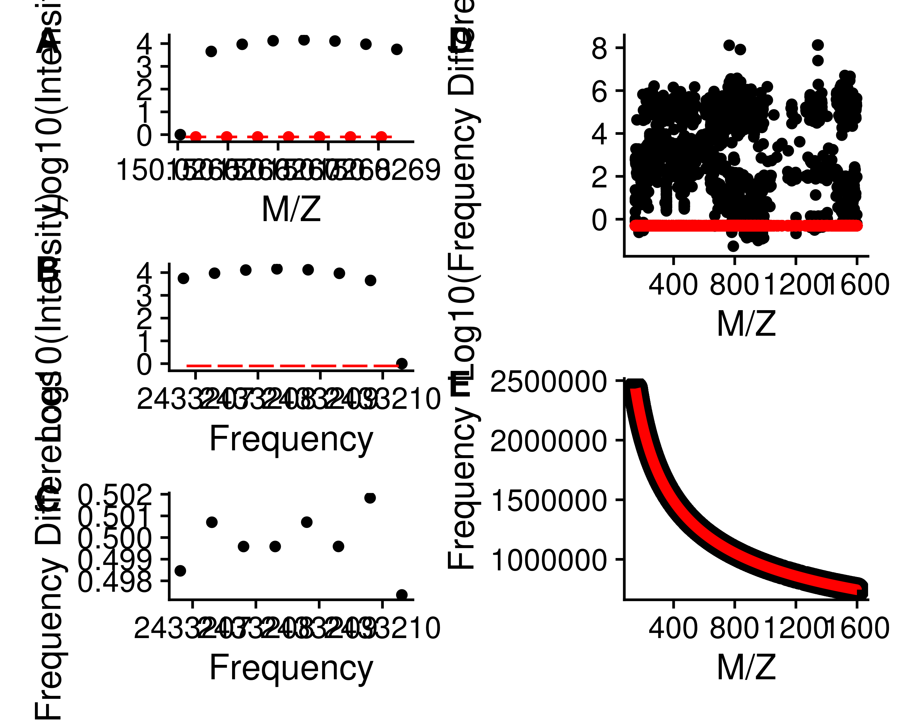
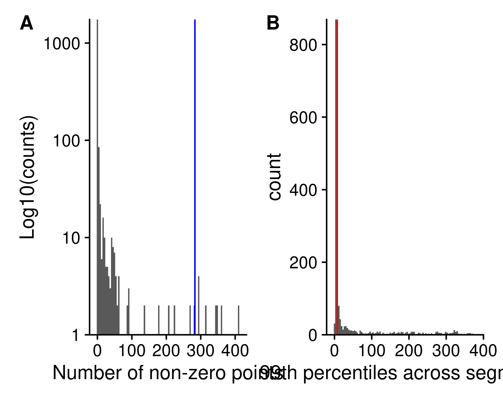
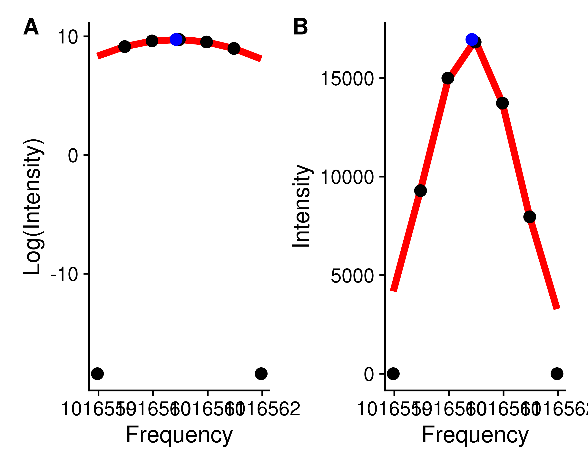
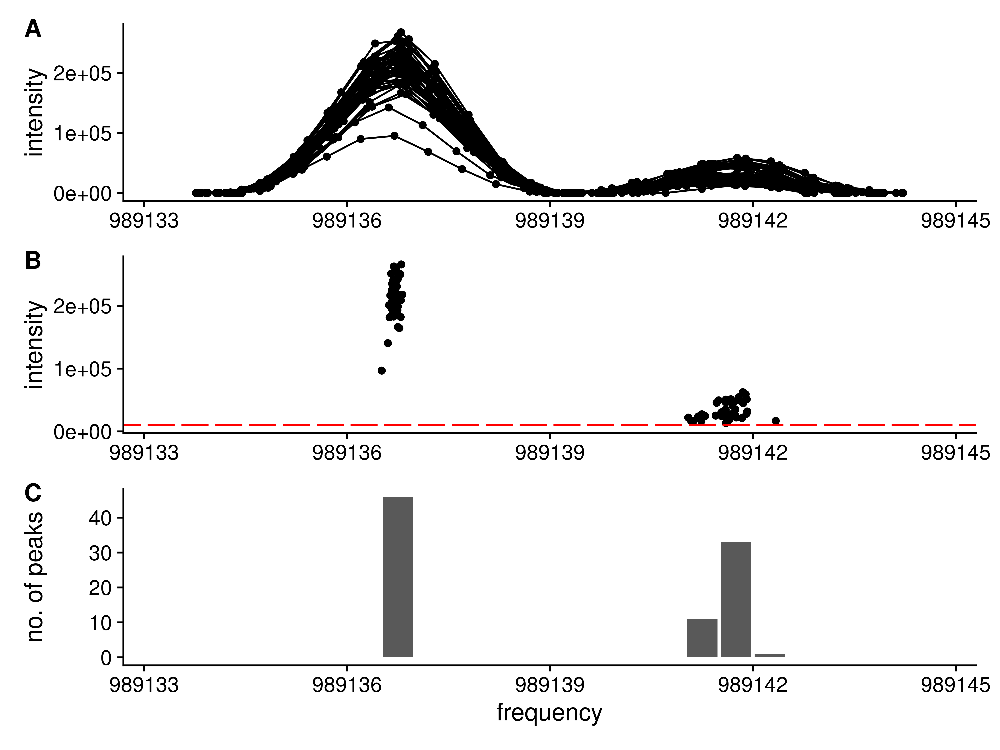
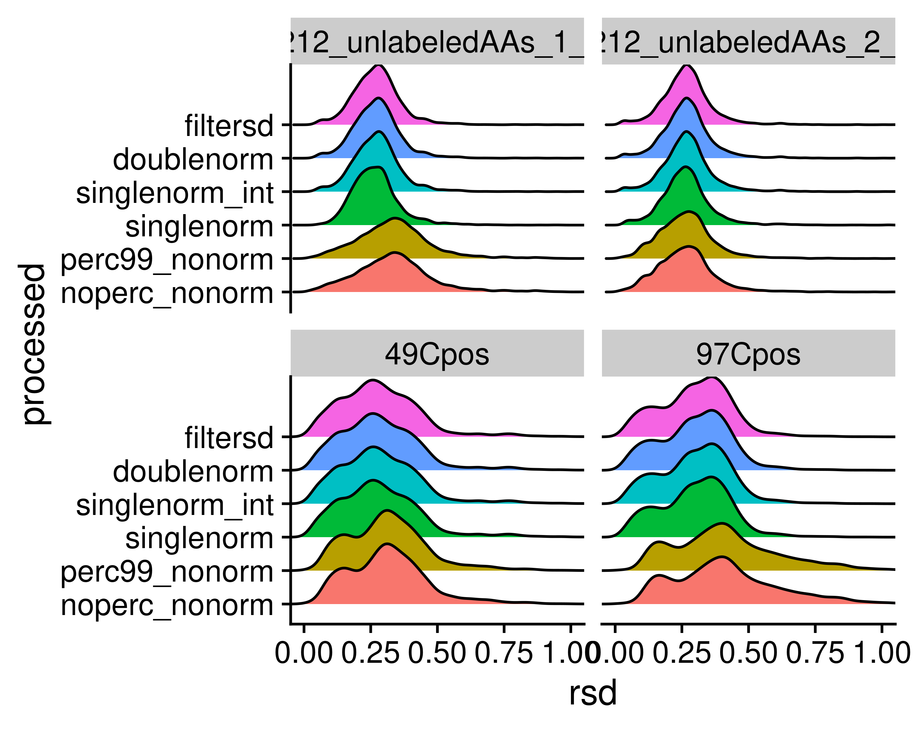

```
## [[1]]
## [[1]]$value
## function (region_list) 
## {
##     use_list = region_list[[1]]
##     frequency_point_regions = use_list$points
##     tiled_regions = use_list$tiles
##     frequency_point_regions = purrr::map(frequency_point_regions, 
##         function(in_scan) {
##             in_scan@elementMetadata$log_int = log(in_scan@elementMetadata$intensity + 
##                 1e-08)
##             in_scan
##         })
##     reduced_peaks = purrr::map_df(names(frequency_point_regions), 
##         function(in_scan) {
##             FTMS.peakCharacterization:::get_reduced_peaks(frequency_point_regions[[in_scan]], 
##                 peak_method = "lm_weighted", min_points = 4, 
##                 which = "frequency")
##         })
##     frequency_multiplier = use_list$points[[1]]@metadata$multiplier
##     reduced_points = FTMS.peakCharacterization:::frequency_points_to_frequency_regions(reduced_peaks, 
##         "ObservedCenter.frequency", frequency_multiplier)
##     tiled_overlap = IRanges::countOverlaps(tiled_regions, reduced_points)
##     original_points = purrr::map_df(use_list$points, ~as.data.frame(.x@elementMetadata))
##     tiled_regions = as.data.frame(use_list$tiles)
##     tiled_regions$start_freq = tiled_regions$start/frequency_multiplier
##     tiled_regions$end_freq = tiled_regions$end/frequency_multiplier
##     tiled_regions$counts = tiled_overlap
##     tiled_regions$mid_point = tiled_regions$start_freq + 0.25
##     tiled_regions$intensity = 10000
##     xmin = min(original_points$frequency - 0.5)
##     xmax = max(original_points$frequency + 0.5)
##     p1 = ggplot(original_points, aes(x = frequency, y = intensity, 
##         group = scan)) + geom_point() + geom_line() + coord_cartesian(xlim = c(xmin, 
##         xmax)) + labs(x = NULL)
##     p2 = ggplot(reduced_peaks, aes(x = ObservedCenter.frequency, 
##         y = Height.frequency)) + geom_point() + geom_segment(data = tiled_regions, 
##         aes(x = start_freq + 0.05, xend = end_freq - 0.05, y = intensity, 
##             yend = intensity), color = "red") + coord_cartesian(xlim = c(xmin, 
##         xmax)) + labs(x = NULL, y = "intensity")
##     p3 = ggplot(tiled_regions, aes(x = mid_point, y = counts)) + 
##         geom_col() + coord_cartesian(xlim = c(xmin, xmax)) + 
##         labs(x = "frequency", y = "no. of peaks")
##     (p1/p2/p3) + plot_annotation(tag_level = "A")
## }
## 
## [[1]]$visible
## [1] FALSE
## 
## 
## [[2]]
## [[2]]$value
## function (mzml_file) 
## {
##     mzml_prof = MSnbase::readMSData(mzml_file, msLevel. = 1, 
##         centroided. = FALSE)
##     mzml_info = get_ms_info(mzml_prof)
##     all_scans_cent = mzml_prof %>% MSnbase::pickPeaks()
##     all_scans_cent_mz = mz(all_scans_cent)
##     all_scans_cent_intensity = intensity(all_scans_cent)
##     all_scans_data = purrr::map_df(seq_len(length(all_scans_cent_mz)), 
##         function(in_scan) {
##             data.frame(mz = all_scans_cent_mz[[in_scan]], intensity = all_scans_cent_intensity[[in_scan]], 
##                 scan = in_scan)
##         })
##     comb_prof = MSnbase::combineSpectra(mzml_prof, method = meanMzInts, 
##         mzd = 0, ppm = 1)
##     comb_cent = comb_prof %>% MSnbase::pickPeaks()
##     comb_cent_data = data.frame(mz = mz(comb_cent)[[1]], intensity = intensity(comb_cent)[[1]])
##     list(scanlevel = all_scans_data, comb = comb_cent_data)
## }
## 
## [[2]]$visible
## [1] FALSE
## 
## 
## [[3]]
## [[3]]$value
## function (...) 
## {
##     hpd_data = list(...)
##     hpd_process = purrr::map_chr(hpd_data, ~.x$processed)
##     print(hpd_process)
##     filtersd = hpd_data[[which(grepl("filtersd", hpd_process))]]
##     sd_cutoff = filtersd$max_sd
## }
## 
## [[3]]$visible
## [1] FALSE
```

## Abstract

We introduce a novel method for characterizing peaks from direct injection FT-MS experiments developed on metabolomics datasets that utilizes frequency values derived directly from the spacing of raw M/Z points. 
Our method incorporates several aspects designed to make the derived intensities trustworthy, and suitable for use in our previously published peak assignment algorithm SMIRFE. 
Notably, the inclusion of an intensity independent noise removal, and normalization of scan level data results in a reduction of median relative standard deviation from **X** to **Y**, and much better fit of peak intensities to relative natural abundances of assigned isotopologues.

## Introduction


## Methods

### Conversion of M/Z to Frequency

The data consists of profile mode M/Z spectra from multiple scans encoded as M/Z and intensity values for each scan. 
There is no information about the original frequency values available in either the `raw` files or the `mzML` files. 
However, the frequency values can be approximated by averaging the M/Z of adjacent points, and dividing the M/Z by the difference. 
Ideally, the difference between subsequent points in frequency space is constant, in practice there is a range of differences in frequency space.
The *true, constant* difference can be obtained by examining the median of the mean frequency differences, and then constraining *useful* points (those that can be used for generating a model of frequency to M/Z) to be within 2% of the mode value. 
These *useful* points can be used to construct a linear model relating M/Z to frequency for individual scans based on the formula:

$$frequency = intercept + x* \frac{1}{\sqrt{mz}} + y * \frac{1}{\sqrt[3]{mz}}$$
From the known physical properties of the orbitrap, only the square root term should be necessary.
Practically, we have found the combination of square and cube-roots to provide a better fit, likely due to issues with slight imperfections in the orbitrap geometry and control of the magnetic fields. 
A frequency model is generated for each scan, and then a single model using the median values of each term across scans is generated, and applied to convert the M/Z values to frequency for all scans. 
A single model rather than scan specific models is used for conversion because this was found to maintain the relative ordering of the peaks in M/Z and frequency space (see Results). 

To convert M/Z back into frequency, we can use a similar model without the roots.

$$mz = intercept + x* \frac{1}{frequency} + y*\frac{1}{frequency^2} + z*\frac{1}{frequency^3}$$

### Frequency Intervals

Two types of frequency intervals are used, sliding and tiled windows. 
In this work, the sliding windows are 10 points wide and offset by one point.
The tiled windows are one point wide and offset by one point.

### Interval Range Based Data

To enable interval algebra, the frequency points are converted to single width intervals by multiplying and rounding (a multiplier of 400 in this work) and storing them as IRanges objects from the IRanges Bioconductor package [citation]. 
The sliding and tiled windows are also converted to IRanges objects the same way.

### Peak Containing Intervals

To find intervals that contain points that are not just noise, the number of non-zero intensity frequency points in each sliding window are counted.
Subsequently, we break these counts into fixed width tiles (default width of 2000) and calculate the 99th percentile of non-zero points for each tile.
The median value x 1.5 of these 99th percentile values from the fixed width tiles is used as the cutoff value to determine which of the initial sliding regions should be kept as regions that contain potential signal.
Any sliding window with a non-zero count less than or equal to the cutoff value is removed, and the remaining sliding windows are reduced, where overlapping windows are merged together to create the initial peak regions.

**Hunter talk about issues around non-detection and why we only use non-zero counts, sliding followed by tiles**.

Within each initial interval region, peaks in each scan are detected (see **Peak Detection**), and their centers binned by the tiled windows. Adjacent tiled windows with non-zero peak counts are merged together, and any zero peak count tiled windows split the initial region into multiple peak interval regions. These interval regions should contain a single **real** peak that was detected in one or more scans.

### Peak Detection and Centroided Values

On a single scan level, possible peaks are detected by simple bump-hunting for two increasing points followed by two decreasing points using the `find_peaks` function in the pracma package [citation]. 
These possible peaks are then characterized using a weighted parabolic fit of log-intensity to position (where position is either M/Z or frequency), and the weights for each point are the relative log-intensity compared to the maximum log-intensity for the peak.

$$\ln{intensity} = intercept + a*position+b*position^2$$
From this weighted parabolic fit the center, intensity, integrated area and sum-of-square residuals can be extracted for the peak. 
These characteristics are equivalent to the centroided peak center and intensity.

Before further processing, the regions are checked that there is only one peak from each scan. If a scan has two or more peaks, then the scan level data in that region is discarded. 
Any regions that subsequently contain zero peaks are removed.

### Scan to Scan Normalization

Scans are normalized to a single *reference* scan based on the log-intensity differences of a subset of peaks that are present in at least the same number of scans as the 95th percentile of scan counts for the peaks. 
In addition, only those peaks that have an intensity greater than 0.7 times the highest intensity peak in the scan are used. 
Pairwise scan-to-scan distances are calculated by taking the cartesian distances between log peak intensities present in both scans, and then the cartesian distance is summed across the scan-to-scan distance to provide an overall difference of each scan to all other scans. 
The scan with the lowest summed overall distance is chosen as the *reference* scan, and normalization factors for each scan are calculated as the median log peak intensity differences in $scan_i$ compared to the reference scan. 
This normalization is done twice, once using all possible peaks, after which the correlation of peak intensity with scan number is checked, and those peaks with correlation of greater than 0.5 with scan number are removed, and the normalization factors are calculated again, and then applied to both the centroided peak height and the raw point intensities.

### Full Characterization

Based on the previously detected peaks, the full set of raw data points for each peak in each scan within a region is known. 
The non-zero intensity, normalized raw data points across scans can be combined, and then characterized again using the weighted parabolic fit previously described. 
In addition to the data from the full set of raw points, means and standard deviations of the peak height and location can be derived from the scan level peak characteristics previously calculated.

In addition to these values, the frequency point-to-point median difference is calculated across all of the raw data points for those points that could be used for modeling frequency to M/Z, and this difference of a single point from the peak center is calculated in frequency space, and converted to M/Z space to provide an "offset" value that is useful to define the search space around the peak for any assignment algorithm.

### Correction of Height and Standard Deviation

Ideally, each peak would be observed in every scan. 
However, in some scans, some peaks are not likely to be observed due to the number of ions falling below the detection threshold. 
This results in a truncated distribution of peak intensities across scans. 
To correct these, either a correction based on a model of the truncated normal distribution can be used, or the differences can be simulated by sampling from data that is present in most of the scans. 
To simulate the effect of peaks missing from some scans on the standard deviations, the peaks present in all scans are used. 
For each peak, a sample of the heights across scans are taken (ranging from 5% to 95% of scans), and a new standard deviation calculated for that fraction, and a ratio of the fractional standard deviation to the "true" standard deviation calculated. 
The ratio sd across peaks can then be fitted to a cubic model of the fraction used, and a correction factor predicted for those peaks that are present in fewer scans. 
The corrected sd's can then be used to correct the mean height assuming that it is the result of a truncated normal distribution [wikipedia reference, https://en.wikipedia.org/wiki/Truncated_normal_distribution].

### Frequency Standard Deviation Filtering

High-peak-density (HPD) artifacts [Mitchell et al., 2018] present as singular peaks with higher than expected frequency standard deviations (FSDs) calculated from the scan-to-scan frequency peak locations. Outliers are detected by calculating the interquartile range (IQR) of the distribution of FSDs across the entire spectrum, and those FSD that are greater than the median plus 1.5 times the IQR (as implemented in boxplot.stats) are removed.
The HPD detection algorithm from Mitchell et al. was re-implemented in R for this work to allow comparisons between it and the use of the FSD.
For HPD detection, the peaks in excel output from Xcalibur were used after converting the M/Z peak centers into frequency space. Sliding windows 1000 frequency points wide and offset by 100 points were used for the density calculations.

### Multi-Class F-Statistics

To evaluate the F-statistic between multi-class samples, a much larger set of samples was used. In this case, 181 matched non-cancer and cancer samples that were previously used in the HPD detection manuscript [ref]. All 181 samples were peak characterized using the most stringent method below as well as peaks generated from the xcms R package [ref], assigned using SMIRFE, and then peaks matched by shared EMFs across samples (see Supplemental materials for a description of peak matching and deciding the most likely EMF). For each matched peak across samples, we kept the peaks present in at least 25% of samples in both classes of sample (disease, non-disease), and calculated the F-statistic for peaks generated using our peak-characterization and those from xcms.

### Samples and Overall Processing

Samples included two ethyl-chloroformate (ECF) derivatized amino-acid samples [reference] and two samples where lipid extracts were extracted from lung tumors [reference]. 
All four samples are positive mode, were converted from raw to mzML using msconvert from ProteoWizard (profile mode) and ThermoRawFileParser (centroided).

For each raw data file in profile mzML format, they were processed in these six ways:

  1. No noise removal, no normalization, no frequency SD filtering (noperc_nonorm)
  2. Noise removal, no normalization, no frequency SD filtering (perc99_nonorm)
  3. Noise removal, single pass normalization with all peaks, no frequency SD filtering (singlenorm)
  4. Noise removal, single pass normalization with high ratio peaks, no frequency SD filtering (singlenorm_int)
  5. Noise removal, two pass normalization, no frequency SD filtering (doublenorm)
  6. Noise removal, two pass normalization, frequency SD filtering (filtersd)

## Results

### Naively Averaged Data Have Bad Relative Intensities

To motivate our solution, we generated peak lists using the peak exporting functionality in Xcalibur (a process we have observed being used to generate datasets), as well as doing a straight averaging of point intensities using identical scans as was kept by our scan filtering (see Methods) in the xcms R package, and finally averaging peaks that were centroided via the Thermo raw file parsing utilities (wrapped by ThermoRawFileParser). 
In all cases, for a known assigned set of peaks, the intensity ratios between the assigned peaks are off compared to what is expected based on natural abundance probability (NAP), as shown in Figure X, with some solutions giving different amounts of error. 
We do note that when all of the peaks are present in a single scan, their relative intensity ratios are much closer to the theoretical ratios based on NAP.

### M/Z to Frequency

FT-MS data from the Thermo-Fisher Orbitrap instrument used to acquire the data does not provide any information about the raw frequency data. 
Outside of the meta-data, it merely contains the M/Z and intensity values for profile spectra acquired across multiple scans. 
However, the frequency can be calculated by dividing the average M/Z of two adjacent points by their difference (Figure XA, red points reresenting the average M/Z of two adjacent points, red lines representing the difference between the two adjacent points). 
The subsequent differences in frequency should be relatively constant with respect to M/Z, in contrast to the differences of adjacent M/Z points, as shown in Figure XB and XC. 
The Thermo Fusion instrument from which most of our collaborators data has been acquired, at a resolution of 400K, has a mode of 0.5, as shown in Figure XC and XD. 
Restricting to those points that fall into a narrow range of frequency differences (0.49 - 0.51), a model of frequency to M/Z can be generated (see Methods), an example of which is shown in Figure XE. 
This model seems to fit the known relationship between frequency and M/Z, where the frequency is related to $1/\sqrt{mz}$. 
This is useful, because some of the subsequent steps in our workflow use sliding and tiled windows where it is assumed that the sliding windows contain the same number of data points. 
M/Z point-to-point differences are not constant, but can be approximated by a lasso linear model; however, it is very difficult to create a lasso model with an intercept of 0.
In addition, we would also need to vary the width of sliding windows according to the M/Z difference at a particular M/Z based on the lasso model.
Frequency based points suffer none of these drawbacks, and the conversion from M/Z can be derived from the raw profile level data itself, which is incredibly useful.


<!-- -->

Figure 1. **A**: Intensity vs M/Z for a single peak from a single scan. 
Red lines denote the differences between each point, and red dots the average between the pair of points. 
The difference over the point is used to derive the frequency values in **B**. 
**B** plots the intensity vs the converted frequency points derived from **A**. 
The red lines denote pairwise differences, which are shown in **C** for this single peak. 
The differences for all peaks across all scans vs M/Z are shown in **D**, with those differences that lie within 0.49 - 0.51 shown in red. 
**E** shows the plot of derived frequency *vs* M/Z, with fitted values from the linear model in red. 

M/Z to frequency models are calculated for each scan, and the square root term from all scan level models are checked for outliers based on the interquartile ranges across all scans in a sample.
While scan specific models **could** be used in the conversion of M/Z to frequency, doing so results in changes to the relative peak ordering compared to M/Z space, as shown in Figure XA. 
Therefore, a single model for all scans based on the median of each term in the model across scans is used for converting *all* remaining scan level data.


<!-- -->

Figure 2. Peak ordering in M/Z compared with ordering in frequency space when a single M/Z to frequency model is used or scan specific M/Z to frequency models are used. 
For a single peak, the scan level peak M/Z's were extracted, and then frequency values for those M/Z generated using a single common model of M/Z to frequency (*single_order*), or models derived from each scan (*scan_order*). 
A subset of the peaks end up out of order using scan specific models, implying that a single model should be used across all the scan level data.

Although the original model is created from only those points that had frequency point-to-point differences within a narrow range, **all** M/Z points are converted to frequency for subsequent steps in the workflow.

### Sliding Window Density to Remove Noise

In a dataset of this nature, we expect that much of the data is really just noise, and doesn't contribute that much to the analysis. 
It is expected that noise is randomly distributed across the scans. 
Therefore, if we slide a window across the data and sum the number of non-zero points in each window, we expect that most of the data we encounter is actually noise. 
The distribution of counts in sliding windows ten points wide and offset by one point is shown in Figure X. 
The number of peaks detected without applying a cutoff explodes by ..., with the vast majority of the peaks being present in a single scan. 
By discarding those windows that have a non-zero point density below the 99th percentile, and merging the remaining adjacent windows, the regions most likely to contain actual, informative peaks are rapidly and easily determined.


<!-- -->

Figure 3. Histogram of the number of non-zero points across all scans in sliding windows 10 frequency points wide and 1 frequency point apart. 
The red vertical line denotes the lower 99th percentile of the data, only sliding windows with non-zero counts above the red line will be kept for subsequent use.

For each region initially created, the peaks in each scan within that region can be characterized using a quadratic fit of log(intensity) to M/Z.

### Peak Characterization Using Quadratic Fit

Although many other types of mass-spectrometry data suffer from a variable, noisy baseline, the scan-level profile data from the Thermo Fusion has a baseline of 0 due to manipulations in the Thermo firmware, making the determination of the centroided values considerably easier. 
For the peak characterization (centroiding), we use a simple quadratic model of log(intensity) to M/Z. 
We add a small constant to enable using the zero values, and weight the values by their ratio to the most intense value, which is normally the value closest to the center of peak, helping to ensure that the **true** centroid is determined. 
From the fitted model, we can derive the centroided center and the intensity of the peak, as shown in Figure X.


<!-- -->

### Breaking Up Initial Regions


With the characterized (centroided) peak data from across scans within each region, it is then important to determine if only one or multiple "peaks" are actually present in the region. 
Our solution to this is to define breaks between **actual** peaks as a single frequency bin with zero characterized peaks within it. 
The frequency bins are created from tiled windows that are one frequency point difference wide. 
Adjacent non-zero frequency bins are merged to comprise a single peak region. 
Figure 5 shows an example where an initial region is broken up into two regions based on the characterized peak centers. 


<!-- -->

Figure 5. 
Splitting a single region into two regions based on the present peaks.
**A**: The full set of raw frequency and intensity data across all scans for the region are shown. 
Clearly the region has two separate peaks within it.
**B**: The peak centroids (frequency and intensity) for each peak in black.
The tiled regions (red) are used to quantify the number of peaks.
**C**: The number of peaks within each tiled region shown as a histogram.
Each group of non-zero adjacent regions will be merged to form a new peak region.

### Normalization of Scans

Due to differences in how many ions are captured in the trap, the peak intensities in each scan vary slightly.
Using the median peak differences between scans, it is possible to normalize the peak intensities across scans.
However, there are two issues with these peak intensities across scans: 1 - Some peak intensities correlate with the scan number; 2 - Some peak differences between scans are correlated with intensity.
The solution to **1** is to do a two pass normalization.
In the first pass, the peaks who's intensity is correlated with intensity are detected.
In the second pass, the correlated peaks are removed, and normalization is carried out again.
Figure XA contains an example peak whose intensity across scans is correlated with scan number.
The solution to **2** (peak differences correlated with intensity) is to only use the most intense peaks, as shown in Figure XB.
The highlighted peaks in Figure XB are those with an intensity greater than 0.7 of the maximum intensity observed in that scan, and at least visually, their differences are **not** correlated with intensity.
If *all* peaks are used for normalization, a very different set of normalization factors will be generated than by using only the *most intense* peaks, as shown in Figure XA and XB.


*caption*: **A**: An example of a peak whose height across scans is correlated with scan number.
**B**: The peak differences to the same peaks in a reference scan are plotted against peak height.
Black: Peaks with a height < 0.7 of the maximum. 
Red: Peaks with a height >= 0.7 of the maximum.


*caption*: **A**: Histogram of scan normalization factors using either a single pass normalization using *all* peaks (singlenorm), single pass normalization using peaks with an intensity >= 0.7 of the maximum intensity (singlenorm_int), or the double pass normalization removing peaks whose height is correlated with scan and using the most intense peaks (doublenorm). 
**B**: The difference of the normalization factors obtained from either doublenorm or singlenorm_int compared to singlenorm.

### Removal of High Peak Density Artefacts

We have previously described the presence of high peak density (HPD) artefacts in FT-MS spectra [Mitchell et al., Metabolomics, 2018]. 
Ideally, the peak characterization procedure should reduce their presence in the resultant reported peaks. 
Their presence should be minimized by removing noise peaks, and removing regions that have multiple reported peaks in the same scan. 
We expect they may present as characterized peaks that have larger than expected frequency standard deviations (FSD) when calculated across scans.
These peaks can be detected by simply examining the distribution of frequency SDs and removing those that are outliers.
To verify the removal of HPD regions, we converted centroided M/Z's from XCalibur to frequency values using the previously calculated values for that sample.
Peak density was measured using a sliding window 10 points wide and offset by one point.

Figure X compares the HPD regions detected using the method from Mitchell et al., and their correspondence with high FSD peaks for one sample (the other comparisons are in Supplemental materials).
Based on this comparison, the high FSD peaks are indeed HPD sites and should be removed before assignment.
However, the FSD does not depend on calculating a sliding window based density, but is merely a product of those peaks across multiple scans that span a wider range frequency range than expected based on the peaks in the data. We also note that we do expect higher M/Z standard deviations at higher M/Z, but the frequency based method does not suffer the same effect, due to the offsets of frequency points being constant.

### Changes in Relative Standard Deviation (RSD)


Each step in the peak characterization either changes the overall number of peaks coming from each scan (sliding windows and breaking initial regions) or the overall intensity of the points within a scan. 
Therefore, one way to quantify any potential *improvements* in the characterized peaks is to look at the relative standard deviation (RSD) for the characterized scan level peak intensities (calculated as the standard deviation of peak heights across scans divided by the mean peak height), and compare them as each processing step is introduced. 

<!-- -->

Figure 6. 
Density plots of relative standard deviations (RSD) of peak heights across scans for each of the processing methods. 
A peak had to be present in at least three scans for the RSD value to be reported.


|processed      |sample                    |  mean| median|  mode|   max|
|:--------------|:-------------------------|-----:|------:|-----:|-----:|
|doublenorm     |161212_unlabeledAAs_1_ECF | 0.274|  0.270| 0.281| 1.415|
|doublenorm     |161212_unlabeledAAs_2_ECF | 0.269|  0.265| 0.267| 1.051|
|doublenorm     |49Cpos                    | 0.285|  0.271| 0.259| 1.133|
|doublenorm     |97Cpos                    | 0.302|  0.310| 0.361| 2.139|
|filtersd       |161212_unlabeledAAs_1_ECF | 0.274|  0.270| 0.281| 1.415|
|filtersd       |161212_unlabeledAAs_2_ECF | 0.269|  0.265| 0.267| 1.051|
|filtersd       |49Cpos                    | 0.285|  0.271| 0.259| 1.133|
|filtersd       |97Cpos                    | 0.302|  0.310| 0.361| 2.139|
|noperc_nonorm  |161212_unlabeledAAs_1_ECF | 0.340|  0.331| 0.340| 1.543|
|noperc_nonorm  |161212_unlabeledAAs_2_ECF | 0.264|  0.259| 0.276| 1.065|
|noperc_nonorm  |49Cpos                    | 0.315|  0.308| 0.311| 1.131|
|noperc_nonorm  |97Cpos                    | 0.419|  0.397| 0.397| 2.110|
|perc99_nonorm  |161212_unlabeledAAs_1_ECF | 0.341|  0.333| 0.341| 1.543|
|perc99_nonorm  |161212_unlabeledAAs_2_ECF | 0.267|  0.262| 0.277| 1.065|
|perc99_nonorm  |49Cpos                    | 0.315|  0.308| 0.311| 1.131|
|perc99_nonorm  |97Cpos                    | 0.419|  0.397| 0.397| 2.110|
|singlenorm     |161212_unlabeledAAs_1_ECF | 0.272|  0.261| 0.281| 2.190|
|singlenorm     |161212_unlabeledAAs_2_ECF | 0.265|  0.261| 0.265| 1.028|
|singlenorm     |49Cpos                    | 0.285|  0.271| 0.260| 1.135|
|singlenorm     |97Cpos                    | 0.301|  0.309| 0.359| 2.143|
|singlenorm_int |161212_unlabeledAAs_1_ECF | 0.274|  0.271| 0.282| 1.424|
|singlenorm_int |161212_unlabeledAAs_2_ECF | 0.269|  0.265| 0.267| 1.048|
|singlenorm_int |49Cpos                    | 0.285|  0.271| 0.261| 1.133|
|singlenorm_int |97Cpos                    | 0.302|  0.310| 0.365| 2.142|

### Difference to Relative Natural Abundance

As an alternative to RSD, we can also compare the fit of relative intensities after assignment using SMIRFE [reference] to the theoretical relative natural abundances (relNAP) of the assigned isotopic molecular formula's (IMFs) within the assigned elemental molecular formula's (EMFs).
Theoretically, we expect that lower quality data will have both lower numbers of assignments, and that for those things that are assigned, the fit between relative intensity and relNAP will be worse.
To compare relative NAP to relative abundances, we only examined the assignments from the two samples containing ECF derivatized amino-acids, as we can limit the assignments to those that match expected derivatizations of the known amino-acids (see Supplemental for the expected EMFs, and expected relative NAPs for the individual IMFs).

### Changes in Variance Across a Large Dataset

For large datasets, we expect that more correct peak intensities will result in better agreement between sample normalized peak intensities within a sample class. 
If incorrect peak intensities are being reported, then we would expect between class to within class variances to be very random, resulting in F-statistics close to 1.

